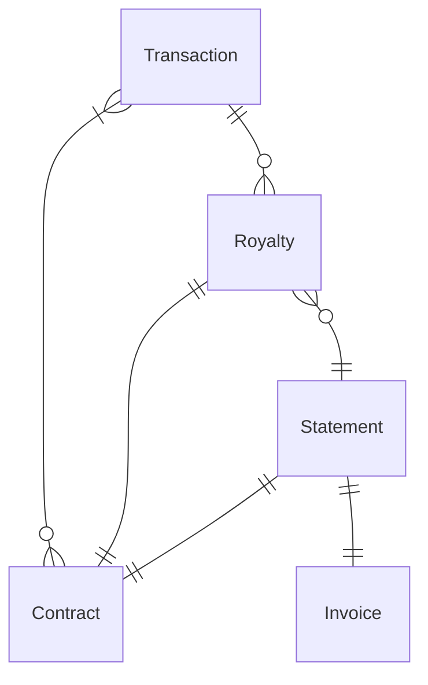

# Learning Business Domains

## Question

How did you get involved or gain knowledge about Royalties so quickly when
joining the team?

## Answer

There are probably multiple answers to this question. I'll try to unpack my
thoughts systematically.

The first answer is probably that I didn't, at the time of writing I've been on
the ROCX team for 2 years, depending on who you ask, that's a long time to be on
any team. So my knowledge didn't come over night and my specific experience on
the team obviously gives me much more insight than I had even a year ago. Any
time you join a team it's going to take time to ramp up to the specifics of what
the team is doing.

The second answer is that it wasn't my first rodeo. This is the third team I've
been on and before I was a software engineer I held several other positions
where I had to learn the ropes of the business, so some of that general
experience helped as I was learning the specifics of Royalties. My personal
system at this point is to become indoctrinated into two parallel worlds.

The first world is the business (or the what). You need to be able to ask
yourself _"what are we trying to accomplish? What is the business outcome we are
achieving?"_

The second world is the technical (or the how). You need to be able to quickly
ask yourself _"how are we achieving the business outcomes we're trying to
achieve"_.

### Business Outcomes

In this industry the chances are better than not that you'll be paid a lot of
money. That's pretty cool, but there's a reason for it, we bring a huge amount
of value to the table (or at least we should). So you should always try to
understand what the actual value is of what you're working on. One thing you
_could_ ask yourself or others is _"how would they do this if we didn't program
anything for them to do it?"_ (More often than not (at least in FinTech) the
answer is a lot of excel). Royalties is actually something of a simple space on
the face of it. We get transactions in, we compute on a per transaction basis
the royalties, we sum those up into the statements, and we produce invoices for
those statements.

Don't discount this: the power of building basic models of the most critical
business flows in the system you work on is very important. You'll find that
nearly everything in royalties will be related to one of those 4 steps. We do
have other deliverables, and there are a lot of technicals related to those 4
steps, but whenever you're lost, finding yourself in the business flow can help
a lot.

### Technicals

> 99% of all software are crud apps, processing pipelines, and database state
> transfers
>
> A statistic I've just made up

Of course the above isn't true. There's systems, OS, ML, etc. but you'll find
that at least most _business applications_ are going to look like the following:

_The database is in state S, we need to perform the function F on that state to
produce the new state S'_

And because a large amount of business applications will either be directly
operating on the database, or operating within some data pipeline which will
make its way to the database, you should consider taking time understanding the
technical data model in the database. I'd normally ask for a couple of things:

1. Types which show me the shape of the database
2. Some form of "Entity Relationship" (ER) Diagram

For example

Once you're understanding the data model _and_ how it relates to the business, I
promise that you'll feel much more in command of your work.

## Summary

Our jobs are not easy. Most people's jobs are to have mastery over both the
business and practice of their work. Our jobs are to have mastery over the
practice, but we are constantly in new businesses, so you'll probably have to
learn and master something like 10 business domains in your life (or more,
depending on how often you change jobs). Every time you switch you bring just a
bit more experience with you with which you can use to understand the next area.
And perhaps most importantly, **give it time**. Most teams do not expect a
developer to be at "full productivity" for something like 9 months. I have no
idea where that number came from, but that seems to be the time frame people are
expecting.
